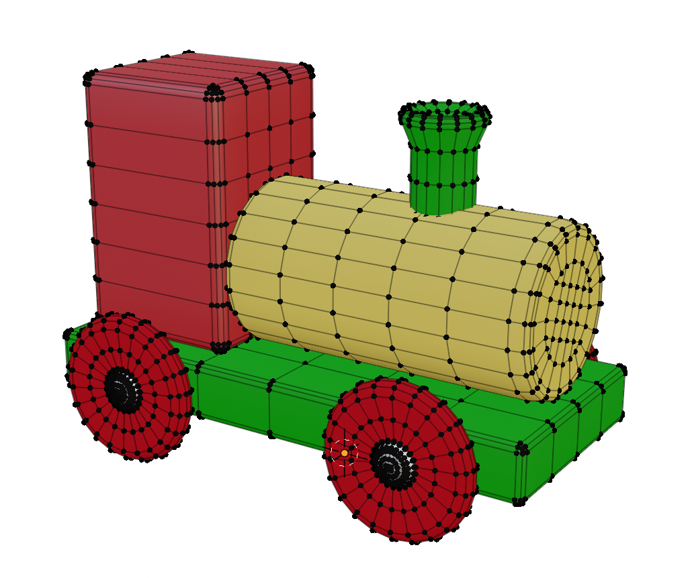
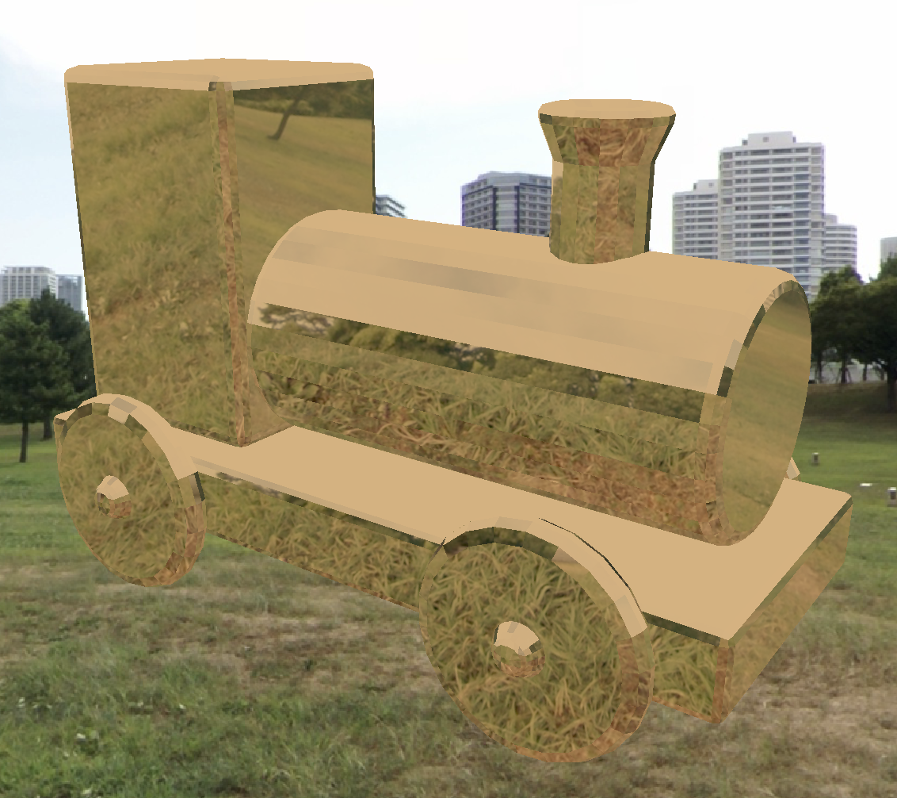
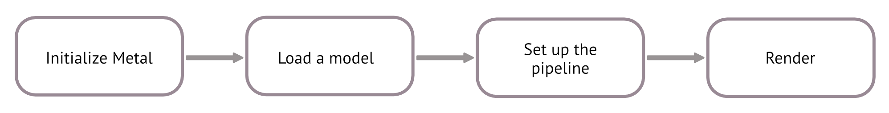
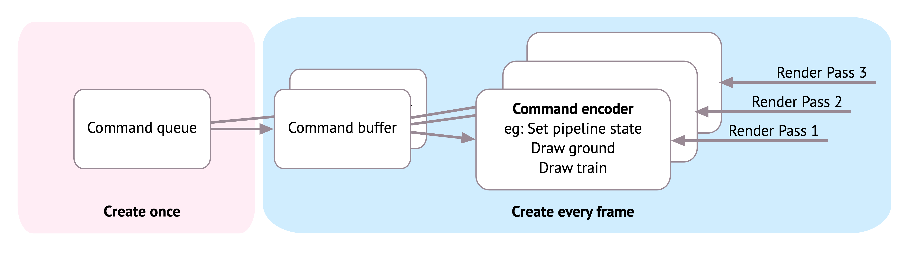
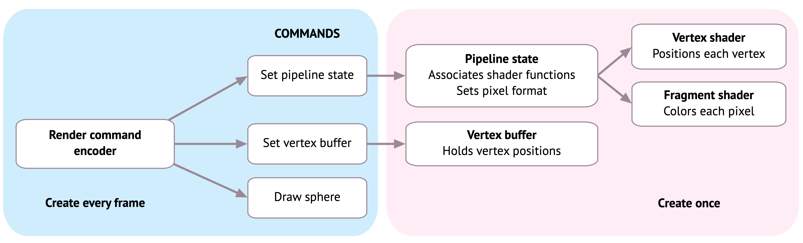
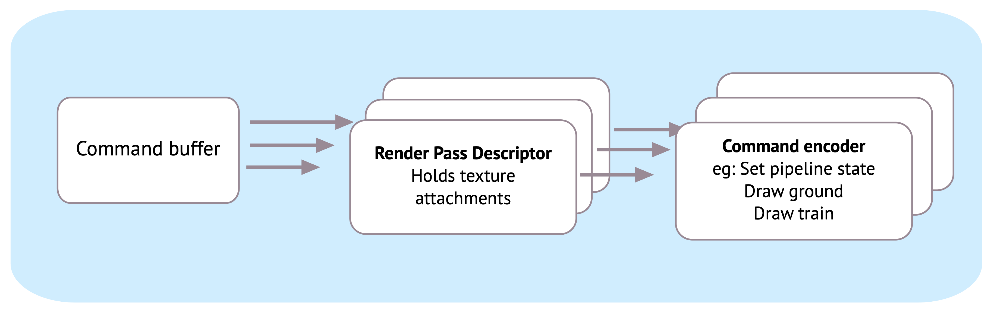
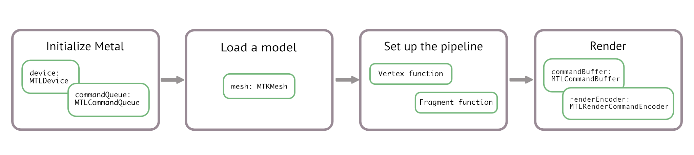

# 01-Metal-Infrastructure
> Metal by tutorials의 Chapter 1 정리

## 렌더링(Rendering)이란?
3D 그래픽스는 정점(vertices)들을 연결해 화면에 이미지를 만드는 과정. 각 픽셀의 빛과 음영을 계산하는 작업이 포함됨. 픽사 영화처럼 품질을 극대화하면 한 장에 며칠이 걸리지만, 게임은 실시간 렌더링(real-time rendering)이 필요.

모델링은 Maya, Blender 등에서 정점(vertex) 기반으로 제작.

<div align="center">

</div>

모델 로더가 정점 리스트를 읽어 GPU로 전달 → 쉐이더 함수가 처리 → 최종 이미지 생성. 이 전체 흐름을 **렌더링 파이프라인(Rendering pipeline)** 이라고 하며, 개발자가 직접 제어하는 **정점 함수(Vertex function)** 와 **조각 함수(Fragment function)** 로 구성됨.

<div align="center">

</div>

## 프레임(Frame)이란?
부드러운 화면을 위해 GPU는 초당 60번 정지 이미지를 렌더링. 이 이미지 하나가 **프레임(Frame)**, 그 속도가 **프레임 레이트(Frame rate)**. 버벅임은 프레임 레이트 저하가 원인. 원하는 효과와 하드웨어 성능 한계 사이의 균형이 중요.

## 첫 Metal App

원근감·쉐이딩 없이 평면처럼 보이는 구체(Sphere)를 렌더링. Metal 렌더링 시퀀스는 앱 규모에 상관없이 동일.




### The Metal View

```swift
import PlaygroundSupport
import MetalKit
```

* `PlaygroundSupport`: 어시스턴트 에디터에서 라이브 뷰를 바로 확인
* `MetalKit`: Metal 편의 프레임워크. `MTKView`, 텍스처 로딩, Model I/O 연동 제공

```swift
guard let device = MTLCreateSystemDefaultDevice() else {
    fatalError("GPU is not supported")
}
```
GPU 지원 여부 확인. 실패 시 iOS playground일 가능성이 높음.

```swift
let frame = CGRect(x: 0, y: 0, width: 600, height: 600)
let view = MTKView(frame: frame, device: device)
view.clearColor = MTLClearColor(red: 1, green: 1, blue: 0.8, alpha: 1)
```

`MTKView`(macOS: NSView, iOS: UIView 서브클래스) 설정. `clearColor`로 배경색(크림색) 지정.

### The Model
Model I/O는 Blender·Maya 등의 3D 모델을 로드하고 렌더링용 데이터 버퍼를 설정하는 프레임워크. 여기서는 외부 모델 대신 기본 프리미티브(Primitive)인 구체를 사용.

```swift
// 1
let allocator = MTKMeshBufferAllocator(device: device)
// 2
let mdlMesh = MDLMesh(
  sphereWithExtent: [0.75, 0.75, 0.75],
  segments: [100, 100],
  inwardNormals: false,
  geometryType: .triangles,
  allocator: allocator)
// 3
let mesh = try MTKMesh(mesh: mdlMesh, device: device)
```

1. 메시 데이터용 메모리 관리 객체
2. 지정된 크기의 구체 생성 (정점 정보가 담긴 MDLMesh 반환)
3. Model I/O 메시 → Metal에서 사용 가능한 MTKMesh로 변환

### Queues, Buffers and Encoders
각 프레임은 GPU에 전송할 명령(Command)들의 묶음. **렌더 커맨드 인코더** → **커맨드 버퍼** → **커맨드 큐** 순으로 계층화됨.



```swift
guard let commandQueue = device.makeCommandQueue() else {
  fatalError("Could not create a command queue")
}
```

디바이스와 커맨드 큐는 앱 시작 시 한 번 생성하여 앱 전체에서 재사용. 초기화 단계에서 모델 데이터 버퍼 로드, 쉐이더 생성, 파이프라인 상태 객체를 미리 생성해 두고, 매 프레임마다 커맨드 버퍼와 렌더 커맨드 인코더를 생성.



### Shader Functions

GPU에서 실행되는 소형 프로그램. C++ 서브셋인 **Metal Shading Language(MSL)** 로 작성. 일반적으로 `.metal` 파일로 관리하지만, 예제에서는 문자열로 직접 추가.

```swift
let shader = """
#include <metal_stdlib>
using namespace metal;

struct VertexIn {
  float4 position [[attribute(0)]];
};

vertex float4 vertex_main(const VertexIn vertex_in [[stage_in]]) {
  return vertex_in.position;
}

fragment float4 fragment_main() {
  return float4(1, 0, 0, 1);
}
"""
```

* `vertex_main`: 정점 위치를 제어
* `fragment_main`: 픽셀 최종 색상 지정

```swift
let library = try device.makeLibrary(source: shader, options: nil)
let vertexFunction = library.makeFunction(name: "vertex_main")
let fragmentFunction = library.makeFunction(name: "fragment_main")
```

컴파일러가 함수 존재를 검증하고 파이프라인 디스크립터에서 사용할 수 있도록 준비.

### The Pipeline State

**파이프라인 상태(Pipeline state)** 는 픽셀 포맷, 뎁스 값, 쉐이더 함수 등 GPU가 필요로 하는 모든 렌더링 정보를 담고 있음. 상태가 고정되면 GPU는 더 효율적으로 동작. 직접 생성 불가하며, 반드시 **디스크립터(Descriptor)** 를 통해 생성.

```swift
let pipelineDescriptor = MTLRenderPipelineDescriptor()
pipelineDescriptor.colorAttachments[0].pixelFormat = .bgra8Unorm
pipelineDescriptor.vertexFunction = vertexFunction
pipelineDescriptor.fragmentFunction = fragmentFunction
```

* `pixelFormat`: BGRA 순서, 채널당 8비트 부호없는 정수

```swift
pipelineDescriptor.vertexDescriptor = MTKMetalVertexDescriptorFromModelIO(mesh.vertexDescriptor)
```

Model I/O가 자동 생성한 정점 디스크립터(메모리 내 정점 배치 정보)를 그대로 사용.

```swift
let pipelineState = try device.makeRenderPipelineState(descriptor: pipelineDescriptor)
```

파이프라인 상태 생성은 비용이 크기 때문에 초기화 시 한 번만 수행. 여러 쉐이더나 정점 배치가 필요하면 복수의 파이프라인 상태를 미리 만들어둠.

### Rendering

정적인 뷰이므로 매 프레임 갱신은 불필요. GPU의 최종 역할은 3D 장면에서 텍스처 하나를 출력하는 것.

#### 렌더 패스(Render Passes)
사실적인 렌더링(그림자, 조명, 반사 등)은 독립된 여러 렌더 패스로 나눠 처리. 예) 그림자 패스에서 그레이스케일 그림자 텍스처 생성 → 두 번째 패스에서 컬러 렌더링 → 두 텍스처를 합쳐 최종 출력.



이 파트에서는 단일 렌더 패스만 사용. `MTKView`는 드로어블 텍스처를 담은 렌더 패스 디스크립터를 기본 제공.

```swift
// 1
guard let commandBuffer = commandQueue.makeCommandBuffer(),
// 2
    let renderPassDescriptor = view.currentRenderPassDescriptor,
// 3
    let renderEncoder = commandBuffer.makeRenderCommandEncoder(descriptor:	renderPassDescriptor)  
else { fatalError() }
```

1. **커맨드 버퍼 생성**: GPU 실행 명령을 저장
2. **렌더 패스 디스크립터 획득**: 렌더링 목적지(어태치먼트) 정보 포함
3. **렌더 커맨드 인코더 획득**: GPU에 전달할 정점 정보 등을 담음

```swift
renderEncoder.setRenderPipelineState(pipelineState)
```
파이프라인 상태를 렌더 인코더에 전달.

```swift
renderEncoder.setVertexBuffer(mesh.vertexBuffers[0].buffer, offset: 0, index: 0)
```
구체 메시의 정점 버퍼를 렌더 인코더에 전달. `offset`은 정점 정보 시작 위치, `index`는 GPU 버텍스 쉐이더가 버퍼를 찾는 위치.

#### 서브메시(Submeshes)
메시는 여러 서브메시로 구성됨. 서로 다른 머티리얼(재질)이 서브메시 단위로 분리. (예: 자동차의 차체와 타이어) 구체는 서브메시가 하나.

```swift
guard let submesh = mesh.submeshes.first else {
  fatalError()
}
```

```swift
renderEncoder.drawIndexedPrimitives(
  type: .triangle,
  indexCount: submesh.indexCount,
  indexType: submesh.indexType,
  indexBuffer: submesh.indexBuffer.buffer,
  indexBufferOffset: 0
)
```
서브메시 인덱스 순서대로 정점들을 삼각형으로 렌더링하도록 GPU에 지시. 실제 렌더링은 커맨드 버퍼가 GPU에 전달된 이후 발생.

```swift
// 1
renderEncoder.endEncoding()
// 2
guard let drawable = view.currentDrawable else {
  fatalError()
}
// 3
commandBuffer.present(drawable)
commandBuffer.commit()
```

1. 렌더 패스 종료
2. MTKView의 드로어블(CAMetalLayer 기반 텍스처) 획득
3. 드로어블을 화면에 표시(present)하고 GPU에 커밋

```swift
PlaygroundPage.current.liveView = view
```
어시스턴트 에디터에서 Metal 뷰 확인. 실행 결과: 크림색 배경 위 빨간 구체.

> 참고: 플레이그라운드는 정상적인 상태에서도 간혹 컴파일이 되지 않거나 실행되지 않을 때가 있음. 코드를 올바르게 작성한 것이 확실하다면, Xcode를 재시작하고 플레이그라운드를 다시 로드한 후, 실행하기 전에 1~2초 정도 기다려야 함.




## 핵심 포인트(Key Points)

* **렌더링(Rendering)**: 3차원 정점들로부터 이미지를 생성하는 것
* **프레임(Frame)**: GPU가 초당 60회 렌더링하는 이미지
* **디바이스(Device)**: 하드웨어 GPU의 소프트웨어 추상화 객체
* **3D 모델**: 정점 메시로 구성, 서브메시 단위로 머티리얼 그룹화
* **커맨드 큐(Command Queue)**: 앱 시작 시 생성. 커맨드 버퍼·인코더를 관리
* **셰이더 함수(Shader Functions)**: GPU에서 실행되는 프로그램. 정점 위치와 픽셀 색상 제어
* **렌더 파이프라인 상태(Render Pipeline State)**: GPU 상태를 고정. 쉐이더 함수, 정점 레이아웃 등을 설정
